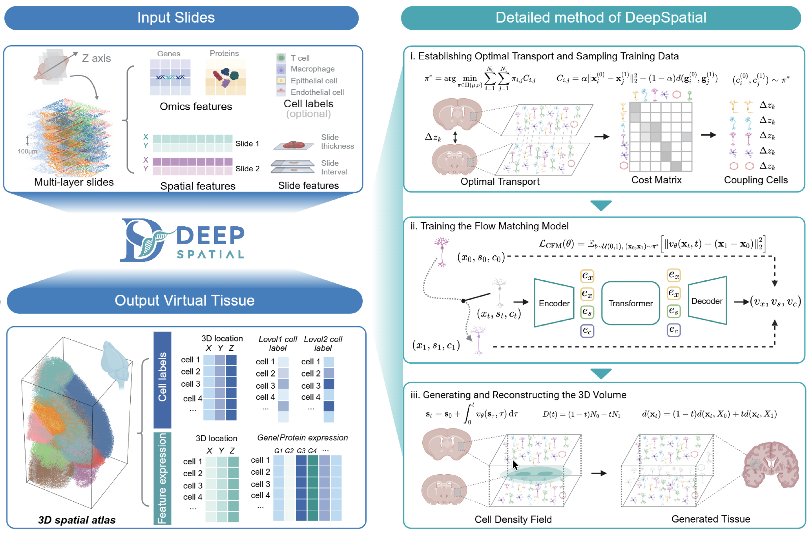
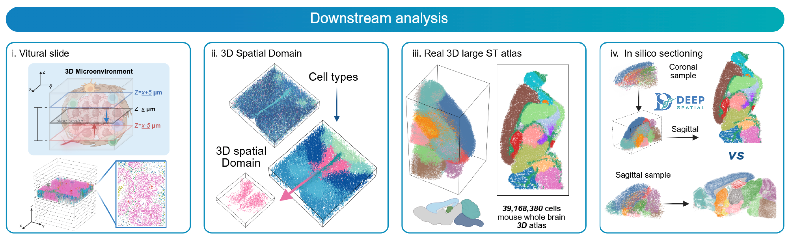

# DeepSpatial: Reconstructing True 3D Spatial Transcriptomics at Single-Cell Resolution


[](https://opensource.org/licenses/MIT)
[](https://opensource.org/licenses/MIT)
[](https://opensource.org/licenses/MIT)

## Introduction

**DeepSpatial** is a deep learning framework designed to reconstruct continuous 3D tissue models from disjointed 2D spatial transcriptomics slices.


By leveraging advanced representation learning and flow matching techniques, DeepSpatial maps discrete spatial omics data into a unified, high-fidelity 3D coordinate space, enabling seamless downstream analysis across tissue sections.


---

## Features

* **Real 3D Reconstruction**: Synthesize missing biological landscapes between pre-aligned 2D slices to recover a high-fidelity, seamless 3D tissue volume.
* **Multi-Omics Support**:
* **Seamless Ecosystem Integration**: Built upon `AnnData` and fully compatible with the `Scanpy` ecosystem for streamlined downstream 3D analysis.
* **GPU Accelerated**: High-performance PyTorch implementation optimized for efficient 3D manifold recovery of large-scale spatial datasets.

---

## Quickstart

Fisrt install the DeepSpatial package via `pip`:

```bash
pip install deepspatial
```

The following example demonstrates a minimal workflow for high-fidelity 3D volumetric reconstruction:

```python
import scanpy as sc
import deepspatial as ds

# Load a sequence of pre-aligned 2D AnnData slices 
# Each slice contains discrete spatial coordinates and gene expression
adatas = [sc.read_h5ad(f"slice_{i}.h5ad") for i in range(5)]

# Initialize the DeepSpatial orchestrator
model = ds.DeepSpatial()

# Prepare multi-modal data structures for 3D modeling
# Sets up joint probability paths for spatial and molecular dimensions
model.setup_data(adatas)

# Construct the generative Flow Matching architecture
model.build_model()

# Execute the training pipeline to learn the continuous 3D manifold
model.fit()

# Synthesize the seamless 3D biological volume
# Reconstructs missing molecular landscapes between original 2D planes
adata_3d = model.reconstruct_full_volume(adatas, thickness=10)
```


```{toctree}
:hidden: true
:maxdepth: 2
:titlesonly: true

installation
tutorials/index
api/index
citation
GitHub <https://github.com/yyh030806/DeepSpatial>
```